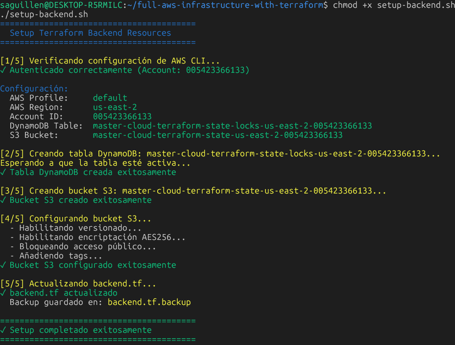
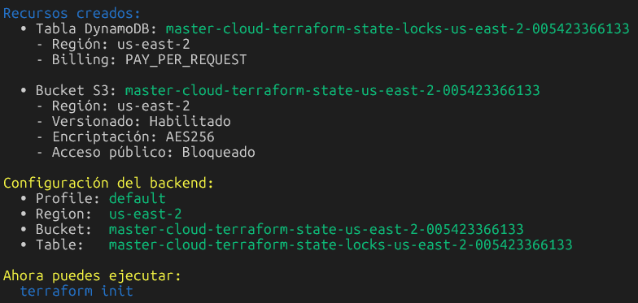
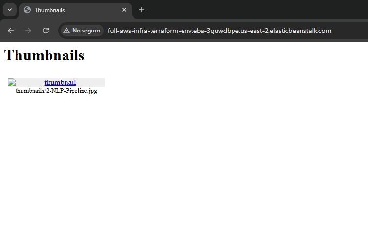

# Infraestructura AWS con Terraform


shell







```shell
Recursos creados:
  • Tabla DynamoDB: master-cloud-terraform-state-locks-us-east-2-005423366133
    - Región: us-east-2
    - Billing: PAY_PER_REQUEST

  • Bucket S3: master-cloud-terraform-state-us-east-2-005423366133
    - Región: us-east-2
    - Versionado: Habilitado
    - Encriptación: AES256
    - Acceso público: Bloqueado

Configuración del backend:
  • Profile: default
  • Region:  us-east-2
  • Bucket:  master-cloud-terraform-state-us-east-2-005423366133
  • Table:   master-cloud-terraform-state-locks-us-east-2-005423366133

Ahora puedes ejecutar:
  terraform init
```


## Archibo backend.tf
```
terraform {
  backend "s3" {
    profile        = "default"
    bucket         = "master-cloud-terraform-state-us-east-2-005423366133"
    key            = "06-demo-final/terraform.tfstate"
    region         = "us-east-2"
    dynamodb_table = "master-cloud-terraform-state-locks-us-east-2-005423366133"
    encrypt        = true
  }
}
```


## Despues de correr terraform init
```shell
Initializing the backend...

Successfully configured the backend "s3"! Terraform will automatically
use this backend unless the backend configuration changes.
Initializing provider plugins...
- Finding hashicorp/aws versions matching ">= 4.0.0"...
- Installing hashicorp/aws v6.27.0...
- Installed hashicorp/aws v6.27.0 (signed by HashiCorp)
Terraform has created a lock file .terraform.lock.hcl to record the provider
selections it made above. Include this file in your version control repository
so that Terraform can guarantee to make the same selections by default when
you run "terraform init" in the future.

Terraform has been successfully initialized!

You may now begin working with Terraform. Try running "terraform plan" to see
any changes that are required for your infrastructure. All Terraform commands
should now work.

If you ever set or change modules or backend configuration for Terraform,
rerun this command to reinitialize your working directory. If you forget, other
commands will detect it and remind you to do so if necessary.
```
## despues de aplicar terraform output
```shell
beanstalk_environment_cname = "full-aws-infra-terraform-env.eba-3guwdbpe.us-east-2.elasticbeanstalk.com"
internet_gateway_id = "igw-064220399b31ae4e8"
nat_gateway_ids = [
  "nat-01cdf845e81b0e906",
  "nat-02cb282393aff919a",
]
private_subnet_ids = [
  "subnet-0587ee54a95fb12ac",
  "subnet-00532381620da33a6",
]
public_subnet_ids = [
  "subnet-08d55e925754f211b",
  "subnet-09b981db0c00f1b74",
]
thumbnails_bucket = "full-aws-infra-terraform-thumbnails-us-east-2-005423366133"
thumbnails_bucket_arn = "arn:aws:s3:::full-aws-infra-terraform-thumbnails-us-east-2-005423366133"
uploads_bucket = "full-aws-infra-terraform-uploads-us-east-2-005423366133"
uploads_bucket_arn = "arn:aws:s3:::full-aws-infra-terraform-uploads-us-east-2-005423366133"
vpc_id = "vpc-099fc00dc6f678125"
```


## Subir imagenes de ejemplo al bucket de uploads
```shell
export UPLOADS_BUCKET="full-aws-infra-terraform-uploads-us-east-
aws s3 cp example_images/2-NLP-Pipeline.jpg s3://$UPLOADS_BUCKET/ --profile default
upload: example_images/2-NLP-Pipeline.jpg to s3://full-aws-infra-terraform-uploads-us-east-2-005423366133/2-NLP-Pipeline.jpg
saguillen@DESKTOP-R5
```


## Acceso galeria de thumbnails
 ```http://full-aws-infra-terraform-env.eba-3guwdbpe.us-east-2.elasticbeanstalk.com/```


No se puede ver la imagen directamente porque el bucket de thumbnails es privado y no permite acceso público. Sin embargo, la aplicación web en Elastic Beanstalk tiene los permisos necesarios para acceder a las imágenes en el bucket de thumbnails y mostrarlas en la galería.


## Salida Ver estado de Elastic Beanstalk
```
saguillen@DESKTOP-R5RMILC:~/full-aws-infrastructure-with-terraform$ aws elasticbeanstalk describe-environments   --environment-names full-aws-infra-terraform-env   --profile default
{
    "Environments": [
        {
            "EnvironmentName": "full-aws-infra-terraform-env",
            "EnvironmentId": "e-xmwet2p3xi",
            "ApplicationName": "full-aws-infra-terraform-beanstalk-app",
            "VersionLabel": "v-db66cc24f08cf913",
            "SolutionStackName": "64bit Amazon Linux 2023 v4.9.0 running Python 3.11",
            "PlatformArn": "arn:aws:elasticbeanstalk:us-east-2::platform/Python 3.11 running on 64bit Amazon Linux 2023/4.9.0",
            "EndpointURL": "awseb-e-x-AWSEBLoa-UT2CBZYTBMLJ-1147427875.us-east-2.elb.amazonaws.com",
            "CNAME": "full-aws-infra-terraform-env.eba-3guwdbpe.us-east-2.elasticbeanstalk.com",
            "DateCreated": "2025-12-18T03:45:34.447000+00:00",
            "DateUpdated": "2025-12-18T03:47:48.597000+00:00",
            "Status": "Ready",
            "AbortableOperationInProgress": false,
            "Health": "Green",
            "HealthStatus": "Ok",
            "Tier": {
                "Name": "WebServer",
                "Type": "Standard",
                "Version": "1.0"
            },
            "EnvironmentLinks": [],
            "EnvironmentArn": "arn:aws:elasticbeanstalk:us-east-2:005423366133:environment/full-aws-infra-terraform-beanstalk-app/full-aws-infra-terraform-env"
        }
    ]
}
```


